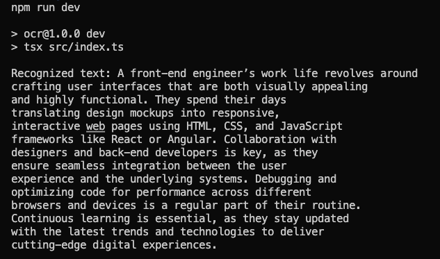

# Sample ORC Tesseract.js Project

This is a sample OCR project that uses the Tesseract.js OCR engine to extract text from images.

This is a companion example repo to the blog post [How to OCR with Tesseract.js to Unlock Text from Images](https://www.timsanteford.com/posts/how-to-ocr-with-tesseract-js-to-unlock-text-from-images/).

## Installation

Clone the repository and install the dependencies using the following command:

```bash
npm install
```

## Usage

To run the OCR engine, use the following command:

```bash
npm run dev
```

The output will be displayed in the console:



## Sample Image Attribution

The sample image used in this project was generated from https://www.mockofun.com/ and is used for demonstration purposes only.